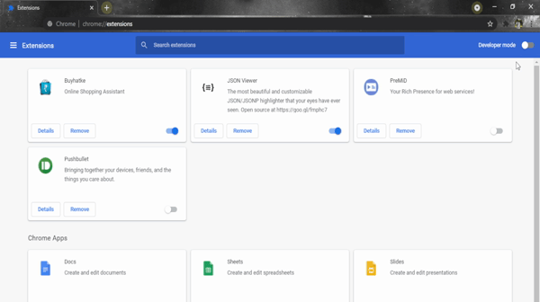
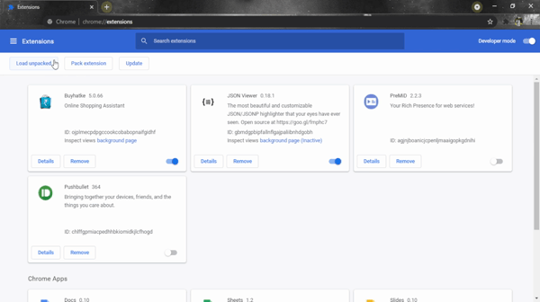

# Calc My Percentage

Always worried about converting my **CGPA** to **%** when I was about to fill in a form for my campus placements. Later, I ended up googling "CGPA to Percentage" and then had to visit a website just to convert my CGPA to percentage which was tiring. I figured that I was wasting time for such a small conversion and the typical way of doing this is to manually calculate using a calculator. 😩

Later, I found out that we can develop extensions for [Chrome](https://www.google.com/intl/en_in/chrome/) browser. Followed few youtube videos and also happened to go through the developer documentation for the same and finally ended up building it😊

Unfortunately, I won't be uploading this extension to the chrome web store as I  have to pay **$5** (approximately ₹350) as a registration fee for lifetime access. For now, you can download the extension by following these steps:

### Steps

1. Download or clone this repository to your local directory.📁
2. Go to [chrome://extensions/](chrome://extensions/) in your browser.🌍
3. Turn on developer mode ☠
   
4. Select **Load Unpacked** on the top left corner and select the folder that you just extracted in step 1.👇
   
5. You are good to go! 👏

##### Date: 2/9/2021